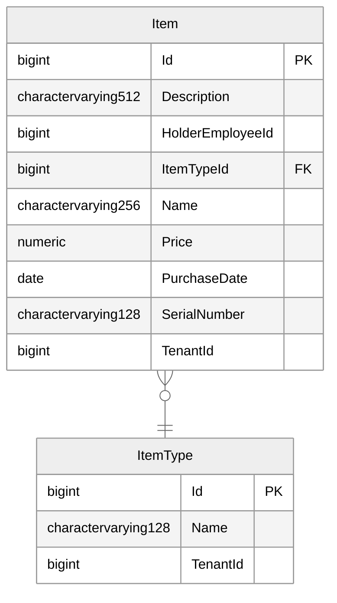

# inner-circle-items-api

<!-- auto-generated -->
[](https://github.com/Yam1xTest/inner-circle-items-api/actions/workflows/calculate-tests-coverage-on-pull-request.yml)
[](https://github.com/Yam1xTest/inner-circle-items-api/actions/workflows/calculate-tests-coverage-on-pull-request.yml)
[](https://github.com/Yam1xTest/inner-circle-items-api/actions/workflows/calculate-tests-coverage-on-pull-request.yml)
<!-- auto-generated -->

This repo contains Inner Circle Items API.

This repo and its infrastructure tailored for VSCode/GitHub Codespaces Dev Container centric development experience in Docker to achieve better isolation of the environment as well as its cross-platform support out of the box. 
For instance, Visual Studio for Mac support stops at .NET 8, thus, we needed something else rather than native Visual Studios for Mac and Windows. We decided to give a shot to VSCode since we use it intensively in other stacks already.

Full info about Inner Circle .NET related code conventions, patterns, decisions, and reasoning can be found [here](https://github.com/TourmalineCore/inner-circle-documentation/blob/master/code-style/api-code-style.md).

More info about the Inner Circle project and its related repos can be found here: [inner-circle-documentation](https://github.com/TourmalineCore/inner-circle-documentation).

## Prerequisites

1. Install Docker Desktop (Windows, macOS) or Docker Engine (Linux)
>Note: It seems like there is Docker Engine for Linux (https://docs.docker.com/desktop/setup/install/linux/ubuntu/).
2. Install Visual Studio Code.
3. Install Visual Studio Code [Dev Containers](https://marketplace.visualstudio.com/items?itemName=ms-vscode-remote.remote-containers) Extension.

## Develop in Dev Container

Open this repo's folder in VSCode/Codespaces, it might immediately propose you to re-open it in a Dev Container or you can click on `Remote Explorer`, find plus button and choose the `Open Current Folder in Container` option and wait when it is ready.

When your Dev Container is ready, the VS Code window will be re-opened. Open a new terminal in this Dev Container which will be executing the commands under this prepared Linux container where we have already pre-installed and pre-configured Inner Circle APIs .NET related dependencies. 

### Run API

```cli
dotnet run --project ./Api
```

### Run Unit and Integrational Tests

To run xUnit unit and integrational tests execute the following script in Terminal:
```cli
dotnet test --verbosity detailed
```

### Run E2E Tests

To run Karate E2E tests execute the following script in Terminal:
```cli
java -jar /karate.jar .
```

### Migrations

Full docs and useful snippets about migrations in this infrastructre setup are available [here](https://github.com/TourmalineCore/inner-circle-documentation/blob/master/code-style/api-code-style.md#migrations).

#### Add Migration

To add a new migration with the domain changes execute the following script in Terminal:
```cli
dotnet ef migrations add <YOUR_NEW_MIGRATION_NAME> --startup-project ./Api/Api.csproj --project ./Application/Application.csproj --context AppDbContext --verbose
```

#### Update Database

To apply pending migrations execute the following script in Terminal:
```cli
dotnet ef database update --startup-project ./Api/Api.csproj --project ./Application/Application.csproj --context AppDbContext --verbose
```

### Allocated Ports & Services

| Service Name               | Api in Dev Container/Codespaces | Api in IDE | Api in Docker Compose |  Db in Docker Compose | MockServer in Docker Compose | PgAdmin in Docker Compose |
| :------------------------- | :-----------------------------: | :--------: | :-------------------: | :-------------------: | :-------------------------: | :-------------------------: |
| inner-circle-items-api     |               4501              |    5501    |          6501         |          7501         |             8501            |             9501            |

Full docs about the allocated ports, reasoning, and the other services bindings in this infrastructre setup are available [here](https://github.com/TourmalineCore/inner-circle-documentation/blob/master/code-style/api-code-style.md#ports).

You can go to `Ports` tab in the `Terminal` parent panel to find available services.

The most useful is `PgAdmin` http://localhost:9501 (password is `postgres`).

## Swagger

You can fetch OpenApi endpoints and types contract using this URL http://localhost:4501/api/swagger/openapi.json. Swagger UI is accessible at http://localhost:4501/api/swagger/index.html. 

However, UI doesn't support requests execution, this requires adding Auth dialog to pass a token. It is a bit trickier starting from .NET 9 due to the change in support of Swagger packagies family `Swashbuckle`, read [here](https://learn.microsoft.com/en-us/aspnet/core/tutorials/getting-started-with-swashbuckle?view=aspnetcore-8.0&tabs=visual-studio) and [there](https://learn.microsoft.com/en-us/aspnet/core/fundamentals/openapi/overview?view=aspnetcore-9.0&preserve-view=true) about that more.

## Database Schema

>Note: Even though here it is PascalCase and singular table name instead of plural (e.g. it should be Items, not Item) in reality it is snake_case for both table names and column names. It seems like the used plugin doesn't support that. For now it looks ok-ish.

<!--- SIREN_START -->

<!--- SIREN_END -->
